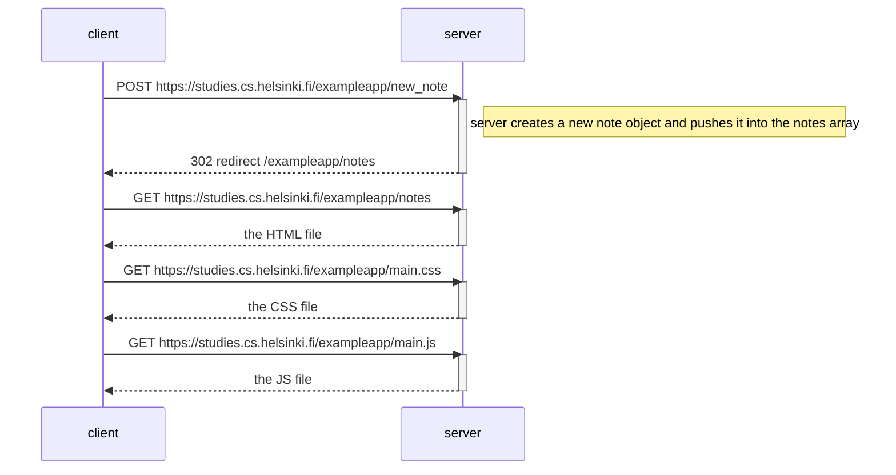

# Fullstackopen course

# Exercise 0.4

What happens when the user creates a new note in https://studies.cs.helsinki.fi/exampleapp/notes?

```mermaid
    sequenceDiagram
        participant client
        participant server
        
        client->>server: POST https://studies.cs.helsinki.fi/exampleapp/new_note
        activate server
        Note right of server: server creates a new note object and pushes it into the notes array
        server-->>client: 302 redirect /exampleapp/notes
        deactivate server
        
        client->>server: GET https://studies.cs.helsinki.fi/exampleapp/notes
        activate server
        server-->>client: the HTML file
        deactivate server
        
        client->>server: GET https://studies.cs.helsinki.fi/exampleapp/main.css
        activate server
        server-->>client: the CSS file
        deactivate server
        
        client->>server: GET https://studies.cs.helsinki.fi/exampleapp/main.js
        activate server
        server-->>client: the JS file
        deactivate server    
```
