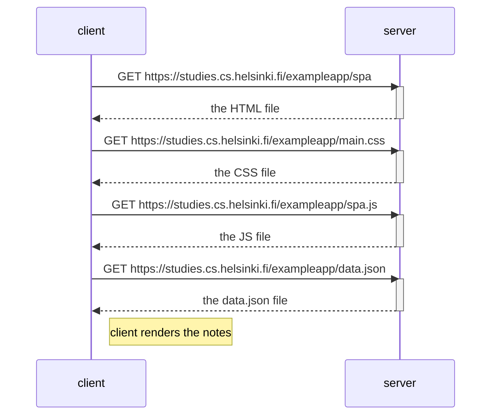

# Fullstackopen course

# Exercise 0.5

What happens when client navigates to https://studies.cs.helsinki.fi/exampleapp/spa?

```mermaid
    sequenceDiagram
        participant client
        participant server
        
        client->>server: GET https://studies.cs.helsinki.fi/exampleapp/spa
        activate server
        server-->>client: the HTML file
        deactivate server
        
        client->>server: GET https://studies.cs.helsinki.fi/exampleapp/main.css
        activate server
        server-->>client: the CSS file
        deactivate server
        
        client->>server: GET https://studies.cs.helsinki.fi/exampleapp/spa.js
        activate server
        server-->>client: the JS file
        deactivate server

        client->>server: GET https://studies.cs.helsinki.fi/exampleapp/data.json
        activate server
        server-->>client: the data.json file
        deactivate server

        Note right of client: client renders the notes
```
