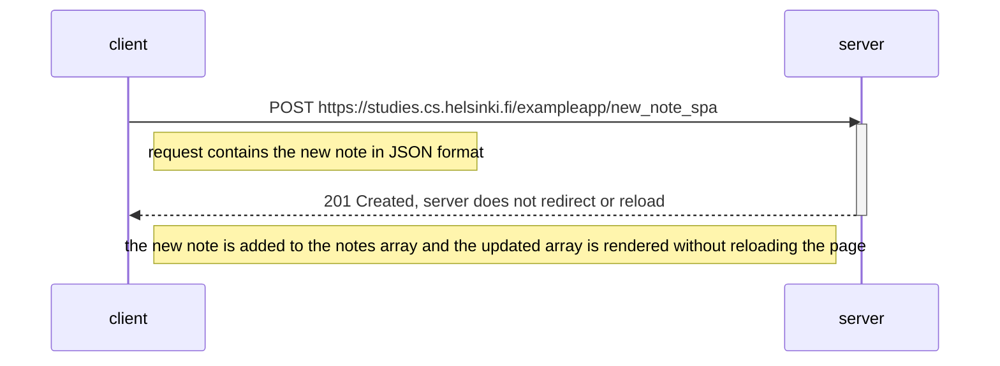

# Fullstackopen course

# Exercise 0.6

What happens when client makes a new note in https://studies.cs.helsinki.fi/exampleapp/spa?

```mermaid
    sequenceDiagram
        participant client
        participant server
        
        client->>server: POST https://studies.cs.helsinki.fi/exampleapp/new_note_spa
        activate server
        Note right of client: request contains the new note in JSON format
        server-->>client: 201 Created, server does not redirect or reload
        deactivate server

        Note right of client: the new note is added to the notes array and the updated array is rendered without reloading the page
```
